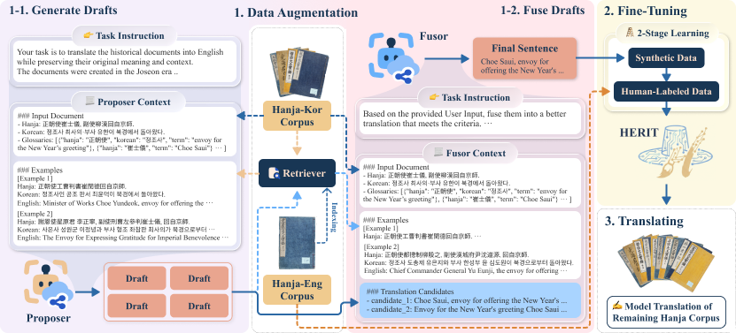

<div align="center">

# HERIT: Enabling Global Access to Hanja-to-English Historical Translation by Mitigating Temporal Bias

<!-- TODO: replace # with actual links once available -->

[](#)
[](#)
[](#)


</div>

**HERIT** addresses the data scarcity and temporal bias inherent in historical archives written in Hanja.
It combines high-quality pseudo-labeled data augmentation via retrieval-augmented generation (RAG) with two-stage fine-tuning.

<div align="center">
  
</div>

## 📋 Table of Contents

- [Highlights](#-highlights)
- [Dataset](#-dataset)
- [Fine-tuned Models](#-fine-tuned-models)
- [Model Versions and Access Dates](#-model-versions-and-access-dates)

## ✨ Highlights

- **Mitigates temporal bias**: human evaluations stratified by reign confirm that HERIT translates robustly across historical periods not covered by expert-translated data.
- **Strong empirical results**: HERIT outperforms strong baselines on lexical-overlap metrics and achieves a preference rate of about **66%** in human expert evaluation.
- **Large-scale pseudo-labeling**: 315K RAG-based pseudo-labeled documents for augmentation, and 2.09M final Hanja-to-English translations.
- **Full pipeline released**: this repository contains the code used to build HERIT — data crawling and preprocessing, pseudo-labeling, fine-tuning, and evaluation.

<!-- ## 📁 Repository Structure

```text
.
├── crawl/                  # Crawlers for AJD / JRS archives and vocabulary
├── data_preprocessing/     # Raw-data preprocessing and human-eval sampling
├── hanja_llm/              # Prompts and dataset utilities
├── module/                 # Shared modules (embedding, few-shot / glossary retrieval, LLM executors)
├── scripts/
│   ├── pre-evaluation/     # Baseline inference (API / vLLM / pivot translation)
│   ├── pseudo_labeling/    # RAG-based pseudo-label generation and review
│   ├── train/              # Two-stage fine-tuning and inference
│   ├── translate_all/      # Full-archive translation
│   └── evaluation/         # N-gram metrics and LLM-as-a-judge evaluation
├── configs/                # Experiment configurations
└── vector_db/              # Vector index for retrieval-augmented generation
```

## 🚀 Getting Started

```bash
git clone https://github.com/dandamdandam/joseon-analysis-v2.git
cd joseon-analysis-v2

# Option 1: conda
conda env create -f environment.yml

# Option 2: pip
pip install -r requirements.txt
```

## 🔧 Pipeline

The end-to-end pipeline consists of the following stages. Each stage has a corresponding entry script:

| Stage | Description | Entry point |
| ----- | ----------- | ----------- |
| 1. Crawling | Collect Hanja documents from historical archives | `crawl/` |
| 2. Preprocessing | Clean and split raw data | `data_preprocessing/preprocessing_raw_data.sh` |
| 3. Pseudo-labeling | RAG-based pseudo-label generation with rejection sampling | `scripts/pseudo_labeling/pseudo_labeling.sh` |
| 4. Fine-tuning | Two-stage fine-tuning of Qwen3 models | `scripts/train/train_run.sh` |
| 5. Full translation | Translate the entire archive | `scripts/translate_all/main.py` |
| 6. Evaluation | N-gram metrics and LLM-as-a-judge | `scripts/evaluation/evaluate_ngram_based_metrics.sh`, `scripts/evaluation/llm_eval.sh` | -->

## 📊 Dataset

> [!NOTE]
> **Work in progress; to be updated by early October 2026.**

| Dataset            | # Documents | Released Fields                      |
| ------------------ | ----------- | ------------------------------------ |
| $D^{train}$        | 15.7K       | (Document ID, Hanja)                 |
| $D^{valid}$        | 1,000       | (Document ID, Hanja)                 |
| $D^{test}$         | 1,000       | (Document ID, Hanja)                 |
| $D^{test}_{NT}$    | 2,080       | (Document ID, Hanja)                 |
| Human-eval subset  | 200         | (Document ID, Hanja)                 |
| $D^{aug}$          | 315K        | (Document ID, Hanja, Pseudo-English) |
| Final translations | 2.09M       | (Document ID, Hanja, Pseudo-English) |

## 🤖 Fine-tuned Models

HERIT model checkpoints (two-stage fine-tuned from Qwen3 8B / 32B). **To be released.**

| Model     | Base Model                                            | Link |
| --------- | ----------------------------------------------------- | ---- |
| HERIT-8B  | [Qwen3-8B](https://huggingface.co/unsloth/Qwen3-8B)   | TBA  |
| HERIT-32B | [Qwen3-32B](https://huggingface.co/unsloth/Qwen3-32B) | TBA  |

## 🗓 Model Versions and Access Dates

<details>
<summary><b>Closed-source models (API)</b></summary>

- Gemini-2.5-Flash (`gemini-2.5-flash`, updated in June 2025)
- Gemini-2.5-Pro (`gemini-2.5-pro`, updated in June 2025)
- Gemini-Embedding (`gemini-embedding-001`)
- GPT-5.1 (`gpt-5.1-2025-11-13`)
- Sonnet-4.5 (`claude-sonnet-4-5-20250929`)
- Sonnet-4.6 (`claude-sonnet-4-6`)

</details>

<details>
<summary><b>Open-weight models</b></summary>

- Qwen3 8B ([unsloth/Qwen3-8B](https://huggingface.co/unsloth/Qwen3-8B), updated May 14, 2025)
- Qwen3 32B ([unsloth/Qwen3-32B](https://huggingface.co/unsloth/Qwen3-32B), updated May 14, 2025)
- Hunyuan-MT-7B ([tencent/Hunyuan-MT-7B](https://huggingface.co/tencent/Hunyuan-MT-7B), updated Sep 18, 2025)
- Qwen3 235B-A22B ([Qwen/Qwen3-235B-A22B-Instruct-2507](https://huggingface.co/Qwen/Qwen3-235B-A22B-Instruct-2507); accessed via Fireworks AI, Aug 2025 – Feb 2026)
- Kimi-K2-Thinking ([moonshotai/Kimi-K2-Thinking](https://huggingface.co/moonshotai/Kimi-K2-Thinking); accessed via Fireworks AI, Nov 2025 – Feb 2026)
- DeepSeek-V3.1 ([deepseek-ai/DeepSeek-V3.1](https://huggingface.co/deepseek-ai/DeepSeek-V3.1); accessed via Fireworks AI, Aug 2025 – Feb 2026)

</details>

<!-- TODO: update once the paper is published -->
<!-- ## 📖 Citation

If you find HERIT useful for your research, please cite:

```bibtex
@article{herit2026,
  title   = {HERIT: Enabling Global Access to Hanja-to-English Historical Translation by Mitigating Temporal Bias},
  author  = {Anonymous},
  year    = {2026}
} -->
